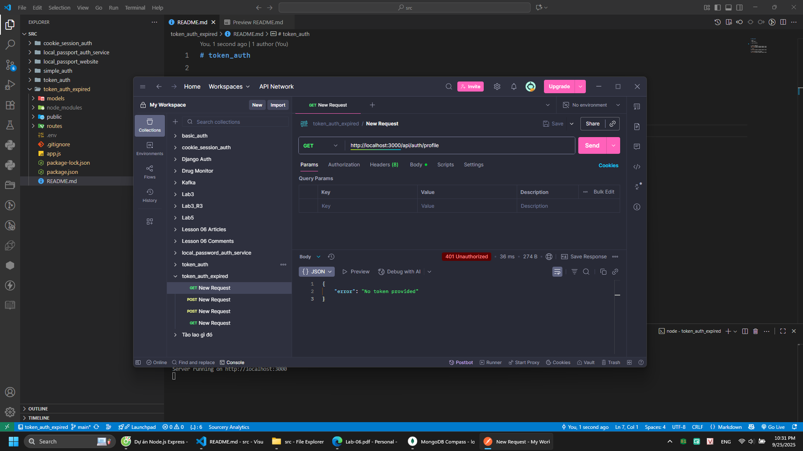
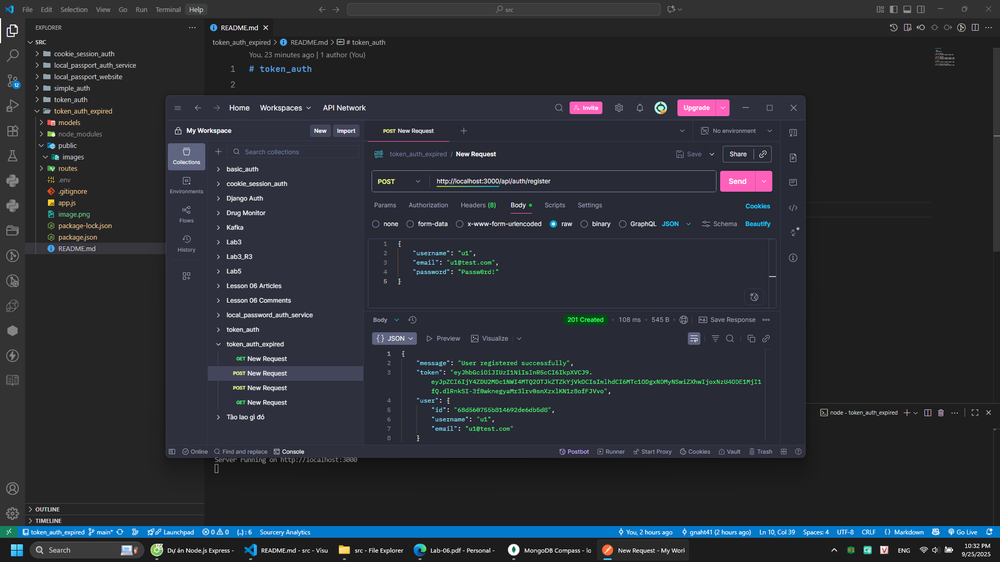
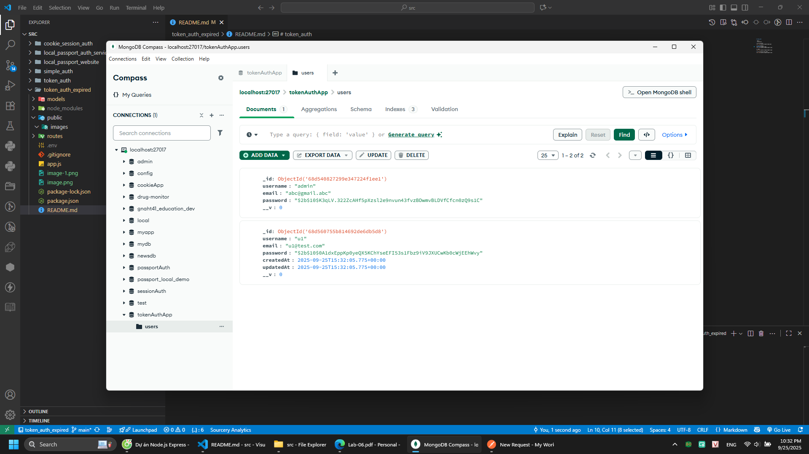
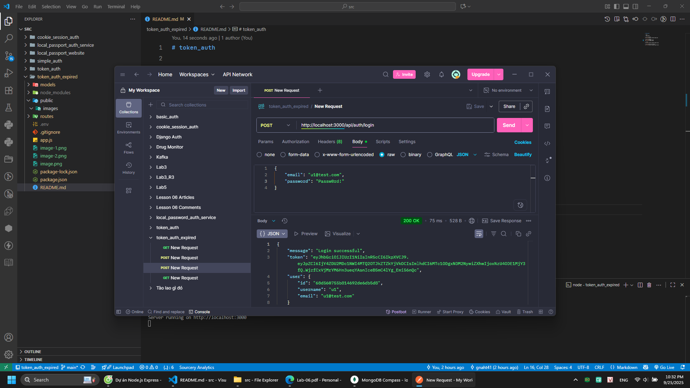
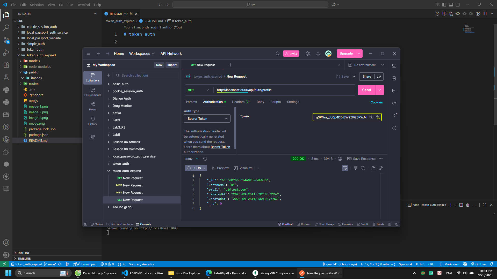
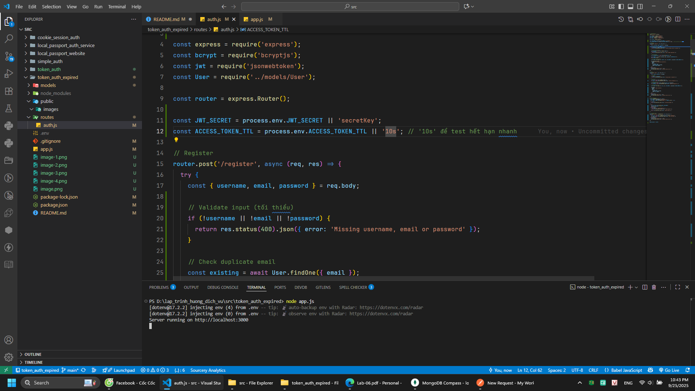
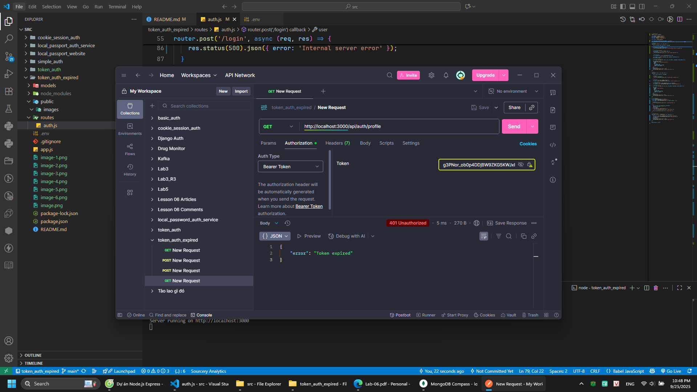
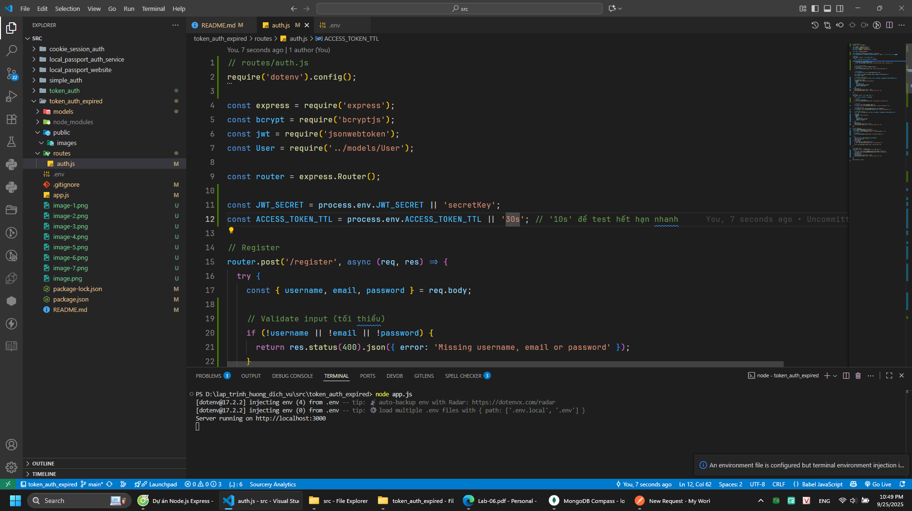
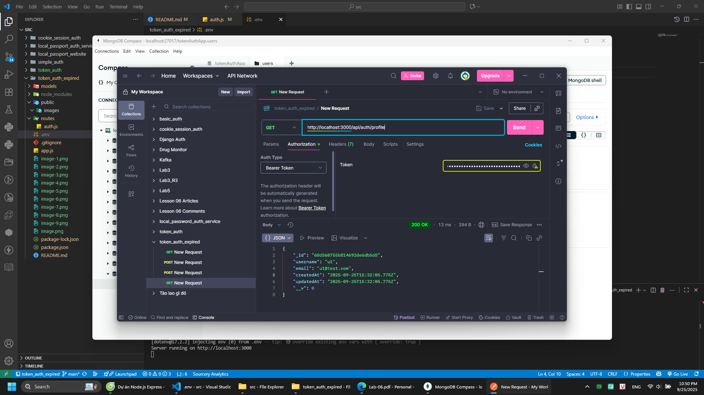

# token_auth

- npm i
- node app.js

1. /profile

2. /register

3. /login

4. /profile with token

## Question: Modify code to make token expried?
- Để hạn là 10s

- Khi hết hạn 

- Gia hạn lên 30s

