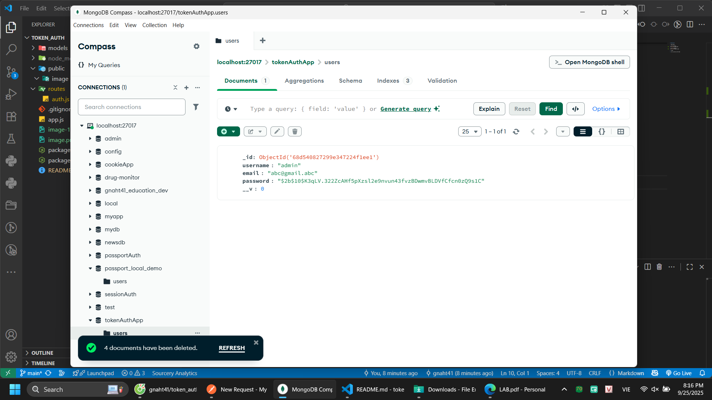
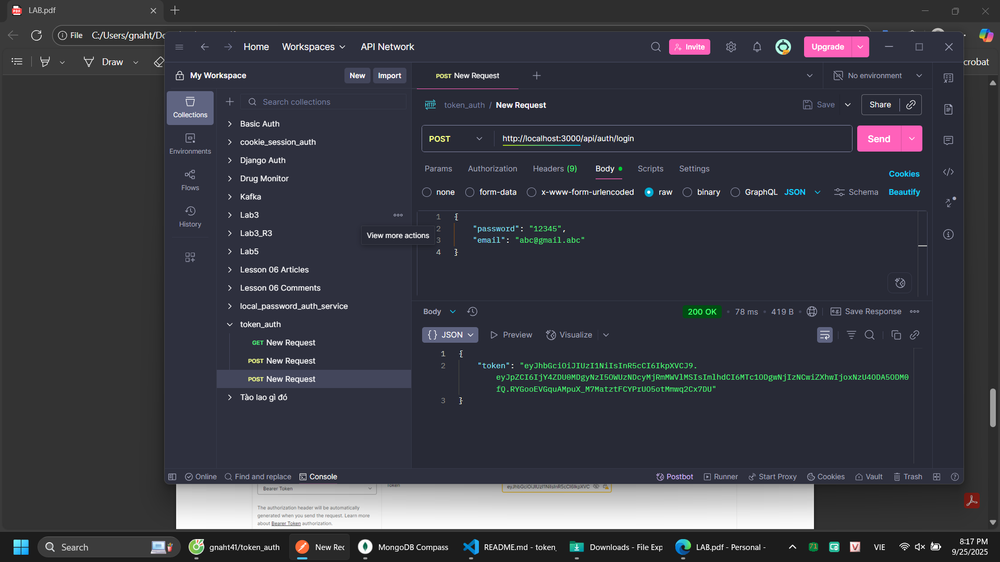

# token_auth

- node app.js

1) `register` (đăng ký) → kiểm tra trong DB 

 

2) `login` (đăng nhập) → kiểm tra trong DB 

3) `profile` (xem trang bảo vệ)  

4) `logout` (đăng xuất) → kiểm tra cookie bị xóa trong DB

